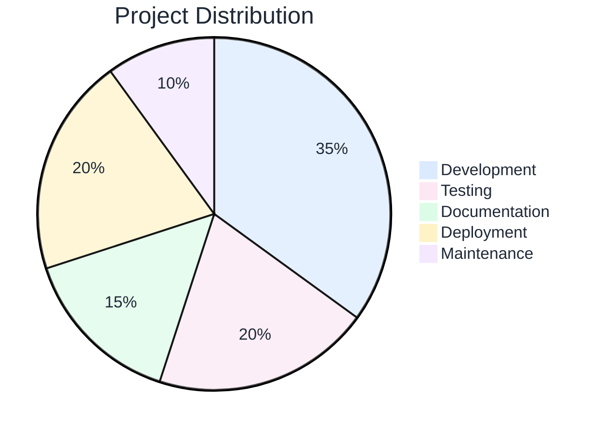
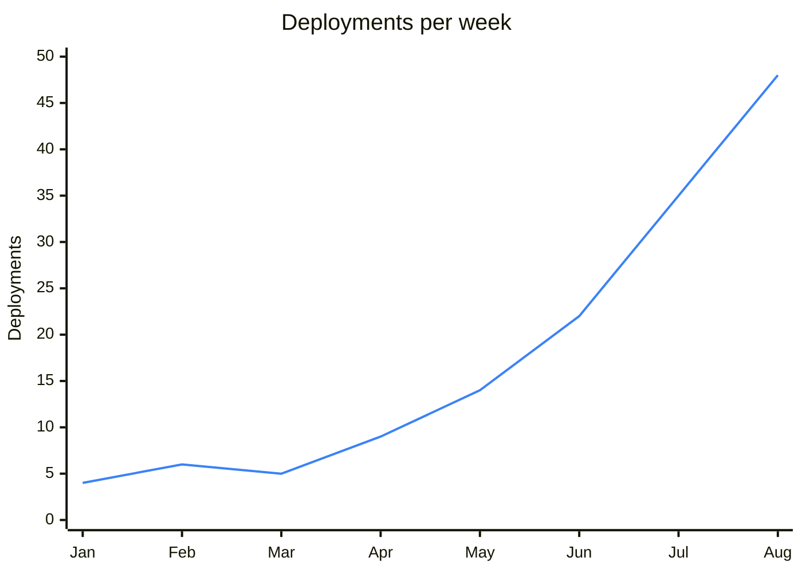

# Your presentation title here

<Subtitle>Subtitle or tagline goes here</Subtitle>

  <PortLogo type="svg" size="2rem" />

<ColorDots />

<!--
Port Slidev Template

Standard slide layouts for Port presentations.
Copy this file to start a new presentation, then delete unused slides.

Usage:
1. Copy this template to outputs/presentations/[name]/slides.md
2. Update theme path: theme: ../../../.claude/skills/slidev-presentation/themes/port
3. Copy images to outputs/presentations/[name]/public/images/
4. Delete slides you don't need
5. Customize content
6. Run: npx @slidev/cli slides.md

All CSS classes and components are provided by the theme.
See themes/port/README.md for component documentation.
-->

---
layout: section
---

# Section title

<Subtitle>Brief description of this section</Subtitle>

<!--
Section divider. Use layout: section for clean section breaks.
-->

---

# The scenario

<Subtitle>Context-setting subtitle here</Subtitle>

<Space size="large" />

<Paragraph bold>Key question or setup:</Paragraph>

<Grid cols="3" gap="4">
  <FeatureCard icon="🎯" title="Point one" color="blue">
    Description of the first point
  </FeatureCard>
  <FeatureCard icon="💡" title="Point two" color="pink">
    Description of the second point
  </FeatureCard>
  <FeatureCard icon="🔧" title="Point three" color="green">
    Description of the third point
  </FeatureCard>
</Grid>

<ImpactBox center>
  Key insight or takeaway from this slide.
</ImpactBox>

<!--
Standard content slide with 3-column grid of feature cards.
-->

---

# The core problem

<Highlight>
How do you frame the key question that this presentation answers?
</Highlight>

<Grid cols="3">
  <FeatureCard icon="📏" title="Constraint 1" color="blue">
    Description of first constraint
  </FeatureCard>
  <FeatureCard icon="📚" title="Constraint 2" color="pink">
    Description of second constraint
  </FeatureCard>
  <FeatureCard icon="🎯" title="Constraint 3" color="green">
    Description of third constraint
  </FeatureCard>
</Grid>

<!--
Problem framing slide. Use Highlight for the key question.
-->

---

# Comparison table

| Approach | What it does | The gap |
|----------|--------------|---------|
| **Option A** | Description of approach | What's missing |
| **Option B** | Description of approach | What's missing |
| **Option C** | Description of approach | What's missing |

<ImpactBox center>
  Summary of what none of these solve
</ImpactBox>

<!--
Table comparison slide. Tables are auto-styled by the theme.
-->

---

# Three options

<Subtitle>User asks: "Help me with something"</Subtitle>

<Grid cols="3">
  <FeatureCard icon="🎫" title="Response A" color="blue">
    First possible response
  </FeatureCard>
  <FeatureCard icon="🔀" title="Response B" color="pink">
    Second possible response
  </FeatureCard>
  <FeatureCard icon="🎲" title="Response C" color="purple">
    Third possible response
  </FeatureCard>
</Grid>

<ImpactBox center spacing="small">
  All valid. None follow your actual process.
</ImpactBox>

<!--
Options comparison slide. Good for showing alternatives.
-->

---

# AI-suggested playbooks

<Subtitle>SRE agent recommends the right action at the right time</Subtitle>

<Space size="large" />

<Image src="/images/ai-suggested-playbooks-sre-agent.png" alt="SRE agent suggesting playbooks" size="large" center />

<!--
Single image slide. Use Image component for consistent styling.
-->

---

# Human vs AI task split

<Grid cols="2" gap="8">
  <Image src="/images/tasks-assignment-human-vs-ai-donut.png" alt="Tasks assignment: AI agents vs humans" />
  <Stack>
    <FeatureCard icon="🤖" title="AI agents" color="blue">
      Handle repetitive, well-defined tasks automatically
    </FeatureCard>
    <FeatureCard icon="👤" title="Humans" color="green">
      Focus on decisions that require context and judgement
    </FeatureCard>
  </Stack>
</Grid>

<!--
Two-column layout with image on left, content on right.
-->

---

# Four pillars

<Subtitle>Key components of the solution</Subtitle>

<Grid cols="2" gap="4">
  <Stack gap="small">
    <FeatureCard icon="🧩" title="Pillar 1" color="blue" size="compact">
      Brief description
    </FeatureCard>
    <FeatureCard icon="🔐" title="Pillar 2" color="pink" size="compact">
      Brief description
    </FeatureCard>
  </Stack>
  <Stack gap="small">
    <FeatureCard icon="🔗" title="Pillar 3" color="green" size="compact">
      Brief description
    </FeatureCard>
    <FeatureCard icon="🌍" title="Pillar 4" color="purple" size="compact">
      Brief description
    </FeatureCard>
  </Stack>
</Grid>

<!--
2x2 grid of compact feature cards. Good for key capabilities.
-->

---

# Governance or features

<Grid cols="2">
  <FeatureCard icon="🔐" title="Feature 1" color="blue">
    Description of the feature
  </FeatureCard>
  <FeatureCard icon="📦" title="Feature 2" color="green">
    Description of the feature
  </FeatureCard>
  <FeatureCard icon="📖" title="Feature 3" color="purple">
    Description of the feature
  </FeatureCard>
  <FeatureCard icon="🏠" title="Feature 4" color="yellow">
    Description of the feature
  </FeatureCard>
</Grid>

<!--
2x2 grid of regular feature cards.
-->

---

# Limitations or caveats

<Grid cols="2" gap="6">
  <FeatureCard icon="🔢" title="Limitation 1" color="yellow">
    Description of limitation. What users should know.
  </FeatureCard>
  <FeatureCard icon="📜" title="Limitation 2" color="orange">
    Description of limitation. On the roadmap.
  </FeatureCard>
</Grid>

<!--
Limitations slide. Be transparent about gaps.
-->

---

# Best practices

<Grid cols="2" gap="4">
  <FeatureCard icon="🎯" title="Practice 1" color="blue">
    Brief explanation
  </FeatureCard>
  <FeatureCard icon="✂️" title="Practice 2" color="pink">
    Brief explanation
  </FeatureCard>
  <FeatureCard icon="📂" title="Practice 3" color="green">
    Brief explanation
  </FeatureCard>
  <FeatureCard icon="🧪" title="Practice 4" color="purple">
    Brief explanation
  </FeatureCard>
</Grid>

<!--
Best practices slide. Quick wins for users.
-->

---
layout: section
---

# Demo

<Subtitle>Let's see it in action</Subtitle>

<!--
Demo section divider.
-->

---

# Demo: step one

<Placeholder title="Video placeholder" subtitle="Recording of step one" />

<!--
Demo slide with video placeholder.
-->

---

# Demo: step two

<Placeholder title="Video placeholder" subtitle="Recording of step two" />

<!--
Another demo slide.
-->

---

# Roadmap timeline

<Subtitle>Key milestones and deliverables</Subtitle>

<Timeline :quarters="['Q4 25', 'Q1 26', 'Q2 26', 'Q3 26', 'Q4 26']">
  <TimelineItem position="above" left="15%" icon="🚀">
    Launch feature A
  </TimelineItem>
  <TimelineItem position="below" left="30%" status="In progress">
    Milestone B
  </TimelineItem>
  <TimelineItem position="above" left="50%" icon="📦">
    Release v2.0
  </TimelineItem>
  <TimelineItem position="below" left="70%" status="Planned">
    Feature C
  </TimelineItem>
</Timeline>

<!--
Timeline slide for roadmaps. Use Timeline component with TimelineItem children.
Position items "above" or "below" the axis. Use left % to position horizontally.
-->

---

# Summary table

| Challenge | Solution |
|-----------|----------|
| Problem 1 | How it's solved |
| Problem 2 | How it's solved |
| Problem 3 | How it's solved |
| Problem 4 | How it's solved |

<ImpactBox center spacing="small">
  Get started: https://docs.port.io
</ImpactBox>

<!--
Summary slide with table of challenges and solutions.
-->

---

# Key metrics

<Subtitle>Performance indicators</Subtitle>

<Grid cols="3">
  <MetricCard value="90%" label="Metric one" />
  <MetricCard value="10x" label="Metric two" />
  <MetricCard value="50%" label="Metric three" />
</Grid>

<!--
Metrics slide using MetricCard components.
-->

---

# Data breakdown

<Subtitle>Project time allocation</Subtitle>

<!--
Pie chart with explicit themeVariables to control colors.
Adjust pie1-pie5 for slice colors, and text color variables for labels.
-->

---

# Improvement over time

<Subtitle>Deployment frequency after platform adoption</Subtitle>

<!--
Line chart showing growth/improvement trend.
Use xychart-beta for bar/line charts. Adjust themeVariables to match your color scheme.
For Port blue: use #3b82f6. For green: #22c55e. For pink: #ec4899.
-->

---

# Cover with hero image

<Subtitle>Use the Port 3D hero illustration for visual impact</Subtitle>

<Grid cols="2" gap="8">
  <Image src="/images/hero-3d-isometric-platform-blocks.jpg" alt="Port hero illustration" size="large" />
  <Stack>
    <FeatureCard icon="🎨" title="Port hero image" color="blue">
      3D platform illustration from the official Port deck template. Use on cover slides or section dividers.
    </FeatureCard>
    <FeatureCard icon="📁" title="File location" color="green" size="compact">
      public/images/hero-3d-isometric-platform-blocks.jpg
    </FeatureCard>
  </Stack>
</Grid>

<!--
hero-3d-isometric-platform-blocks.jpg is the 3D hero asset from the official Port deck template.
All 80+ Port product screenshots are in themes/port/public/images/ with descriptive names.
-->

---
layout: image-right
image: /images/cicd-pipeline-self-healing-status.png
---

# Product in action

<Subtitle>CI/CD pipelines with AI self-healing</Subtitle>

<Space size="large" />

<Stack inline>
  <FeatureCard icon="✨" title="AI self-healing" color="blue" size="compact">
    Pipelines automatically recover from failures
  </FeatureCard>
  <FeatureCard icon="🔗" title="GitHub native" color="green" size="compact">
    Triggered directly from your existing workflows
  </FeatureCard>
  <FeatureCard icon="👥" title="Team visibility" color="purple" size="compact">
    See who triggered what, and what succeeded
  </FeatureCard>
</Stack>

<!--
image-right layout: image fills the right half, content on the left.
Use Port product screenshots from public/images/ for realistic demos.
-->

---
layout: wide-image
---

# Port at a glance

<Subtitle>A single platform for your entire engineering org</Subtitle>

<Space size="large" />

<ImpactBox center spacing="small">
  From context lake to self-service — in one place.
</ImpactBox>

::right::

<Image src="/images/port-platform-devex-survey-screenshot.png" alt="Port platform screenshot" size="full" />

<!--
wide-image layout: content on left 40%, image fills right 60%.
Good for product screenshots where detail matters.
-->

---

# Three steps

<Grid cols="3">
  <StepItem n="1" title="Step one">
    Description of what happens in step one
  </StepItem>
  <StepItem n="2" title="Step two">
    Description of what happens in step two
  </StepItem>
  <StepItem n="3" title="Step three">
    Description of what happens in step three
  </StepItem>
</Grid>

<!--
Step-by-step process using StepItem components.
-->

---

# Key takeaways

<Grid cols="3">
  <StepItem n="1" title="Takeaway one">
    Supporting explanation
  </StepItem>
  <StepItem n="2" title="Takeaway two">
    Supporting explanation
  </StepItem>
  <StepItem n="3" title="Takeaway three">
    Supporting explanation
  </StepItem>
</Grid>

<Space size="large" />

  <Tag color="blue">Tag 1</Tag>
  <Tag color="pink">Tag 2</Tag>
  <Tag color="green">Tag 3</Tag>

<!--
Takeaways slide with tags at the bottom.
-->

---
layout: section
---

# Available images

<Subtitle>Port product screenshots</Subtitle>

<Note>Reference as /images/[name] in Image components</Note>

<!--
Image catalogue section. The slides below list all available images from themes/port/public/images/.
Delete these slides before presenting — they are for reference only.
-->

---

# Image catalogue: product UI

<Grid cols="3" gap="4">
  <FeatureCard icon="🖥️" title="cicd-pipeline-self-healing-status.png" color="blue" size="small">
    CI/CD pipeline list with self-healing AI status
  </FeatureCard>
  <FeatureCard icon="📊" title="deployments-risk-strategy-table.png" color="green" size="small">
    Deployments table with risk level and rollout strategy
  </FeatureCard>
  <FeatureCard icon="🍩" title="tasks-assignment-human-vs-ai-donut.png" color="pink" size="small">
    Tasks assignment donut chart: human vs AI agents
  </FeatureCard>
  <FeatureCard icon="🤖" title="ai-suggested-playbooks-sre-agent.png" color="purple" size="small">
    SRE agent suggested playbooks with Run buttons
  </FeatureCard>
  <FeatureCard icon="📋" title="port-platform-devex-survey-screenshot.png" color="yellow" size="small">
    Full Port portal: DevEx survey page
  </FeatureCard>
  <FeatureCard icon="🔧" title="self-service-actions-grid-mcp.png" color="blue" size="small">
    Self-service actions grid with MCP availability
  </FeatureCard>
</Grid>

<!--
Catalogue slide 1: core product UI screenshots.
-->

---

# Image catalogue: AI and agents

<Grid cols="3" gap="4">
  <FeatureCard icon="💬" title="ai-chat-create-s3-bucket.png" color="blue" size="small">
    AI chat modal: Create an S3 Bucket with Agent mode
  </FeatureCard>
  <FeatureCard icon="🔍" title="ai-rca-incident-report-card.png" color="pink" size="small">
    RCA card: root cause analysis for latency incident
  </FeatureCard>
  <FeatureCard icon="⏪" title="ai-revert-last-version-approval.png" color="green" size="small">
    AI action card: Revert last version with Approve/Decline
  </FeatureCard>
  <FeatureCard icon="🔗" title="ai-suggested-connections-confidence.png" color="purple" size="small">
    Suggested connections with confidence scores
  </FeatureCard>
  <FeatureCard icon="🛡️" title="ai-agent-security-prompt-mission.png" color="yellow" size="small">
    AI agent Prompt card: mission and constraints
  </FeatureCard>
  <FeatureCard icon="⚙️" title="sre-agent-config-accessible-data.png" color="blue" size="small">
    SRE agent config: accessible data and allowed actions
  </FeatureCard>
</Grid>

<!--
Catalogue slide 2: AI interactions and agent configuration.
-->

---

# Image catalogue: metrics and charts

<Grid cols="3" gap="4">
  <FeatureCard icon="📈" title="incidents-solved-by-agents-line-chart.png" color="blue" size="small">
    Line chart: incidents solved by agents trending up
  </FeatureCard>
  <FeatureCard icon="📉" title="ticket-lead-time-trend-line-chart.png" color="green" size="small">
    Line chart: ticket lead time declining Jan–May
  </FeatureCard>
  <FeatureCard icon="📊" title="scorecards-progress-line-chart.png" color="pink" size="small">
    Multi-line chart: scorecard progress over time
  </FeatureCard>
  <FeatureCard icon="⚡" title="agent-vs-eng-ticket-time-bar-chart.png" color="purple" size="small">
    Bar chart: agent (0.2 days) vs engineer (3.7 days) per ticket
  </FeatureCard>
  <FeatureCard icon="🔢" title="ai-pr-throughput-merge-rate-dashboard.png" color="yellow" size="small">
    Dashboard: AI PR throughput, merge rate, escalation rate
  </FeatureCard>
  <FeatureCard icon="🏆" title="developer-productivity-driver-scores.png" color="blue" size="small">
    Driver vs score table: ease to release, deep work, etc.
  </FeatureCard>
</Grid>

<!--
Catalogue slide 3: metrics, KPIs, and data visualisation screenshots.
-->

---

# Image catalogue: governance and access

<Grid cols="3" gap="4">
  <FeatureCard icon="🗺️" title="service-catalog-entity-relations-map.png" color="blue" size="small">
    Entity relationship diagram: teams → services → deployments
  </FeatureCard>
  <FeatureCard icon="📜" title="new-scorecard-bronze-silver-gold-rules.png" color="green" size="small">
    New scorecard wizard: Bronze/Silver/Gold rules
  </FeatureCard>
  <FeatureCard icon="🔐" title="data-access-permission-services-policy.png" color="pink" size="small">
    Data access permission panel with policy JSON editor
  </FeatureCard>
  <FeatureCard icon="👥" title="action-permissions-teams-users-agents.png" color="purple" size="small">
    Action permissions: teams, users, agents, manual approval
  </FeatureCard>
  <FeatureCard icon="🔑" title="new-policy-condition-builder.png" color="yellow" size="small">
    New Policy modal: condition builder with Where/Or clauses
  </FeatureCard>
  <FeatureCard icon="🎨" title="portal-branding-organisation-setup.png" color="blue" size="small">
    Portal branding setup: org name, logo, theme color
  </FeatureCard>
</Grid>

<!--
Catalogue slide 4: governance, permissions, and platform configuration.
-->

---

# Image catalogue: 3D icons and hero assets

<Grid cols="3" gap="4">
  <FeatureCard icon="🏗️" title="hero-3d-isometric-platform-blocks.jpg" color="blue" size="small">
    Port 3D hero: isometric platform blocks with icons — use on cover slides
  </FeatureCard>
  <FeatureCard icon="🐙" title="3d-icon-github-gitlab-integrations.png" color="green" size="small">
    3D icons: GitHub Octocat and GitLab fox on pedestals
  </FeatureCard>
  <FeatureCard icon="🤖" title="3d-icon-claude-action-integration.png" color="pink" size="small">
    3D icons: Claude starburst, lightning bolt, action arrow
  </FeatureCard>
  <FeatureCard icon="🔗" title="agents-context-lake-diagram.png" color="purple" size="small">
    Agents diagram: 5 AI providers connected to Port context lake
  </FeatureCard>
  <FeatureCard icon="✨" title="ai-provider-logos-row.png" color="yellow" size="small">
    Row of 5 AI provider logos: Claude, OpenAI, Azure AI, Gemini
  </FeatureCard>
  <FeatureCard icon="🏙️" title="port-billboard-logo-outdoor.jpg" color="blue" size="small">
    Outdoor billboard photograph with Port logo
  </FeatureCard>
</Grid>

<!--
Catalogue slide 5: 3D icon assets and hero images for cover slides and section dividers.
Full list of all available images is in themes/port/public/images/.
-->

---
layout: cover
---

# Questions?

<Subtitle>Closing line here</Subtitle>

  <PortLogo type="svg" size="2rem" />

<ColorDots />

<!--
Closing slide. Uses cover layout for centered content.
-->
