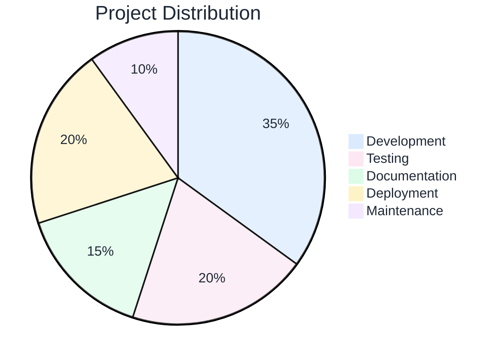

# Your presentation title here

<Subtitle>Subtitle or tagline goes here</Subtitle>

  <PortLogo type="svg" size="2rem" />

<ColorDots />

<!--
Port Slidev Template

Standard slide layouts for Port presentations.
Copy this file to start a new presentation, then delete unused slides.

Usage:
1. Copy this template to outputs/presentations/[name]/slides.md
2. Update theme path: theme: ../../../.claude/skills/slidev-presentation/themes/port
3. Copy images to outputs/presentations/[name]/public/images/
4. Delete slides you don't need
5. Customize content
6. Run: npx @slidev/cli slides.md

All CSS classes and components are provided by the theme.
See themes/port/README.md for component documentation.
-->

---
layout: section
---

# Section title

<Subtitle>Brief description of this section</Subtitle>

<!--
Section divider. Use layout: section for clean section breaks.
-->

---

# The scenario

<Subtitle>Context-setting subtitle here</Subtitle>

<Space size="large" />

<Paragraph bold>Key question or setup:</Paragraph>

<Grid cols="3" gap="4">
  <FeatureCard icon="🎯" title="Point one" color="blue">
    Description of the first point
  </FeatureCard>
  <FeatureCard icon="💡" title="Point two" color="pink">
    Description of the second point
  </FeatureCard>
  <FeatureCard icon="🔧" title="Point three" color="green">
    Description of the third point
  </FeatureCard>
</Grid>

<ImpactBox center>
  Key insight or takeaway from this slide.
</ImpactBox>

<!--
Standard content slide with 3-column grid of feature cards.
-->

---

# The core problem

<Highlight>
How do you frame the key question that this presentation answers?
</Highlight>

<Grid cols="3">
  <FeatureCard icon="📏" title="Constraint 1" color="blue">
    Description of first constraint
  </FeatureCard>
  <FeatureCard icon="📚" title="Constraint 2" color="pink">
    Description of second constraint
  </FeatureCard>
  <FeatureCard icon="🎯" title="Constraint 3" color="green">
    Description of third constraint
  </FeatureCard>
</Grid>

<!--
Problem framing slide. Use Highlight for the key question.
-->

---

# Comparison table

| Approach | What it does | The gap |
|----------|--------------|---------|
| **Option A** | Description of approach | What's missing |
| **Option B** | Description of approach | What's missing |
| **Option C** | Description of approach | What's missing |

<ImpactBox center>
  Summary of what none of these solve
</ImpactBox>

<!--
Table comparison slide. Tables are auto-styled by the theme.
-->

---

# Three options

<Subtitle>User asks: "Help me with something"</Subtitle>

<Grid cols="3">
  <FeatureCard icon="🎫" title="Response A" color="blue">
    First possible response
  </FeatureCard>
  <FeatureCard icon="🔀" title="Response B" color="pink">
    Second possible response
  </FeatureCard>
  <FeatureCard icon="🎲" title="Response C" color="purple">
    Third possible response
  </FeatureCard>
</Grid>

<ImpactBox center spacing="small">
  All valid. None follow your actual process.
</ImpactBox>

<!--
Options comparison slide. Good for showing alternatives.
-->

---

# Image with context

<Subtitle>Explanation of what the image shows</Subtitle>

<Space size="large" />

<Placeholder title="Image placeholder" subtitle="Add your image to public/images/" />

<!--
Single image slide. Use Image component for consistent styling.
-->

---

# Two-column with image

<Grid cols="2" gap="8">
  <Placeholder title="Image" subtitle="Add to public/images/" />
  <Stack>
    <FeatureCard icon="✅" title="Pros" color="green">
      Benefits listed here
    </FeatureCard>
    <FeatureCard icon="⚠️" title="Cons" color="pink">
      Drawbacks listed here
    </FeatureCard>
  </Stack>
</Grid>

<!--
Two-column layout with image on left, content on right.
-->

---

# Four pillars

<Subtitle>Key components of the solution</Subtitle>

<Grid cols="2" gap="4">
  <Stack gap="small">
    <FeatureCard icon="🧩" title="Pillar 1" color="blue" size="compact">
      Brief description
    </FeatureCard>
    <FeatureCard icon="🔐" title="Pillar 2" color="pink" size="compact">
      Brief description
    </FeatureCard>
  </Stack>
  <Stack gap="small">
    <FeatureCard icon="🔗" title="Pillar 3" color="green" size="compact">
      Brief description
    </FeatureCard>
    <FeatureCard icon="🌍" title="Pillar 4" color="purple" size="compact">
      Brief description
    </FeatureCard>
  </Stack>
</Grid>

<!--
2x2 grid of compact feature cards. Good for key capabilities.
-->

---

# Governance or features

<Grid cols="2">
  <FeatureCard icon="🔐" title="Feature 1" color="blue">
    Description of the feature
  </FeatureCard>
  <FeatureCard icon="📦" title="Feature 2" color="green">
    Description of the feature
  </FeatureCard>
  <FeatureCard icon="📖" title="Feature 3" color="purple">
    Description of the feature
  </FeatureCard>
  <FeatureCard icon="🏠" title="Feature 4" color="yellow">
    Description of the feature
  </FeatureCard>
</Grid>

<!--
2x2 grid of regular feature cards.
-->

---

# Limitations or caveats

<Grid cols="2" gap="6">
  <FeatureCard icon="🔢" title="Limitation 1" color="yellow">
    Description of limitation. What users should know.
  </FeatureCard>
  <FeatureCard icon="📜" title="Limitation 2" color="orange">
    Description of limitation. On the roadmap.
  </FeatureCard>
</Grid>

<!--
Limitations slide. Be transparent about gaps.
-->

---

# Best practices

<Grid cols="2" gap="4">
  <FeatureCard icon="🎯" title="Practice 1" color="blue">
    Brief explanation
  </FeatureCard>
  <FeatureCard icon="✂️" title="Practice 2" color="pink">
    Brief explanation
  </FeatureCard>
  <FeatureCard icon="📂" title="Practice 3" color="green">
    Brief explanation
  </FeatureCard>
  <FeatureCard icon="🧪" title="Practice 4" color="purple">
    Brief explanation
  </FeatureCard>
</Grid>

<!--
Best practices slide. Quick wins for users.
-->

---
layout: section
---

# Demo

<Subtitle>Let's see it in action</Subtitle>

<!--
Demo section divider.
-->

---

# Demo: step one

<Placeholder title="Video placeholder" subtitle="Recording of step one" />

<!--
Demo slide with video placeholder.
-->

---

# Demo: step two

<Placeholder title="Video placeholder" subtitle="Recording of step two" />

<!--
Another demo slide.
-->

---

# Roadmap timeline

<Subtitle>Key milestones and deliverables</Subtitle>

<Timeline :quarters="['Q4 25', 'Q1 26', 'Q2 26', 'Q3 26', 'Q4 26']">
  <TimelineItem position="above" left="15%" icon="🚀">
    Launch feature A
  </TimelineItem>
  <TimelineItem position="below" left="30%" status="In progress">
    Milestone B
  </TimelineItem>
  <TimelineItem position="above" left="50%" icon="📦">
    Release v2.0
  </TimelineItem>
  <TimelineItem position="below" left="70%" status="Planned">
    Feature C
  </TimelineItem>
</Timeline>

<!--
Timeline slide for roadmaps. Use Timeline component with TimelineItem children.
Position items "above" or "below" the axis. Use left % to position horizontally.
-->

---

# Summary table

| Challenge | Solution |
|-----------|----------|
| Problem 1 | How it's solved |
| Problem 2 | How it's solved |
| Problem 3 | How it's solved |
| Problem 4 | How it's solved |

<ImpactBox center spacing="small">
  Get started: https://docs.port.io
</ImpactBox>

<!--
Summary slide with table of challenges and solutions.
-->

---

# Key metrics

<Subtitle>Performance indicators</Subtitle>

<Grid cols="3">
  <MetricCard value="90%" label="Metric one" />
  <MetricCard value="10x" label="Metric two" />
  <MetricCard value="50%" label="Metric three" />
</Grid>

<!--
Metrics slide using MetricCard components.
-->

---

# Data visualization

<Subtitle>Interactive charts with Mermaid</Subtitle>

<Space size="large" />

<!--
Mermaid charts are fully supported in Slidev.
You can create pie charts, flowcharts, sequence diagrams, and more.
The theme colors are customized to match Port's palette.
-->

---

# PowerPoint template assets

<Subtitle>Extracted design elements from Deck template new.pptx</Subtitle>

<Grid cols="3" gap="4">
  <Image src="/images/image1.png" alt="Asset 1" />
  <Image src="/images/image2.png" alt="Asset 2" />
  <Image src="/images/image3.png" alt="Asset 3" />
</Grid>

<Grid cols="3" gap="4">
  <Image src="/images/image4.png" alt="Asset 4" />
  <Image src="/images/image5.png" alt="Asset 5" />
  <Image src="/images/image7.png" alt="Asset 7" />
</Grid>

<!--
7 images extracted from the PowerPoint template.
See references/pptx-design-elements.md for color scheme and details.
-->

---

# Three steps

<Grid cols="3">
  <StepItem n="1" title="Step one">
    Description of what happens in step one
  </StepItem>
  <StepItem n="2" title="Step two">
    Description of what happens in step two
  </StepItem>
  <StepItem n="3" title="Step three">
    Description of what happens in step three
  </StepItem>
</Grid>

<!--
Step-by-step process using StepItem components.
-->

---

# Key takeaways

<Grid cols="3">
  <StepItem n="1" title="Takeaway one">
    Supporting explanation
  </StepItem>
  <StepItem n="2" title="Takeaway two">
    Supporting explanation
  </StepItem>
  <StepItem n="3" title="Takeaway three">
    Supporting explanation
  </StepItem>
</Grid>

<Space size="large" />

  <Tag color="blue">Tag 1</Tag>
  <Tag color="pink">Tag 2</Tag>
  <Tag color="green">Tag 3</Tag>

<!--
Takeaways slide with tags at the bottom.
-->

---
layout: cover
---

# Questions?

<Subtitle>Closing line here</Subtitle>

  <PortLogo type="svg" size="2rem" />

<ColorDots />

<!--
Closing slide. Uses cover layout for centered content.
-->
