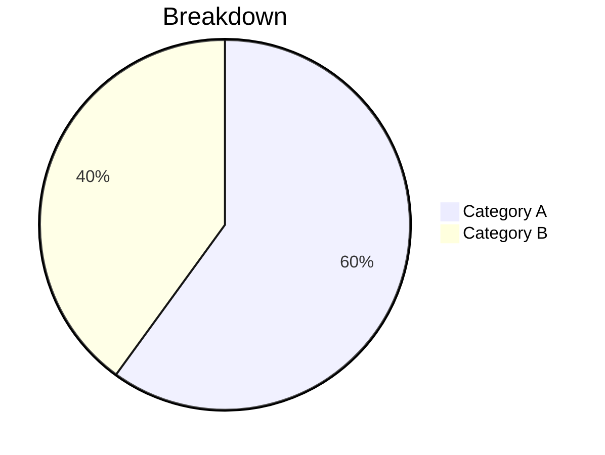
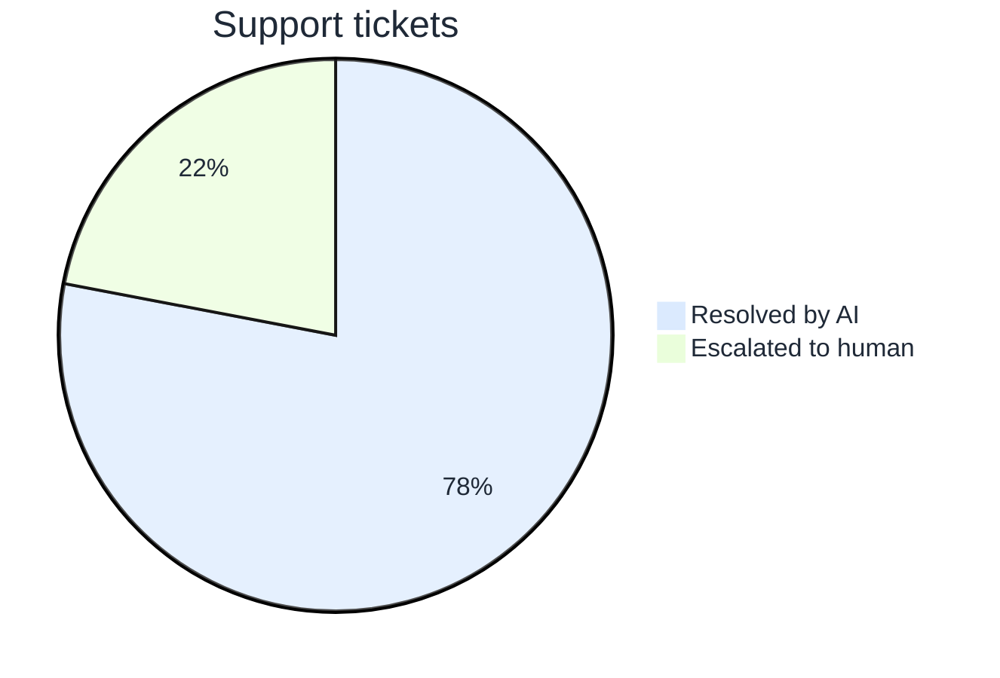

# Port Slidev theme

A reusable Slidev theme with Port branding, custom layouts, and pre-built components.

## Usage

Reference the theme in your presentation's frontmatter:

```yaml
---
theme: ../../../.claude/skills/slidev-presentation/themes/port
title: Your Presentation
---
```

Adjust the relative path based on your presentation's location.

## Layouts

| Layout | Props | Purpose |
|--------|-------|---------|
| `cover` | - | Title slide with centered content |
| `section` | `number` | Section divider with optional big number |
| `default` | - | Standard content slide |

### Section layout example

```markdown
---
layout: section
number: "01"
---

# Section title

<Subtitle>Optional subtitle</Subtitle>
```

## Components

### Grid

Responsive grid layout for organizing content.

| Prop | Type | Default | Description |
|------|------|---------|-------------|
| `cols` | Number/String | 2 | Number of columns |
| `gap` | Number/String | 6 | Gap between items (multiplied by 0.25rem) |

```html
<Grid cols="3" gap="4">
  <div>Item 1</div>
  <div>Item 2</div>
  <div>Item 3</div>
</Grid>
```

### Image

Display images with consistent styling.

| Prop | Type | Default | Description |
|------|------|---------|-------------|
| `src` | String | Required | Image source path |
| `alt` | String | "" | Alt text |
| `rounded` | Boolean | true | Apply rounded corners |
| `size` | String | "full" | "small", "medium", "large", "full" |
| `center` | Boolean | false | Center the image horizontally |

```html
<Image src="/images/example.png" alt="Example" />

<Image src="/images/small.png" size="medium" center />
```

### Stack

Vertical stack layout for grouping elements.

| Prop | Type | Default | Description |
|------|------|---------|-------------|
| `gap` | String | "medium" | "small", "medium", "large" |

```html
<Stack gap="small">
  <FeatureCard ... />
  <FeatureCard ... />
</Stack>
```

### Subtitle

Muted text positioned below the heading.

```html
# Slide title

<Subtitle>Supporting context for the heading</Subtitle>
```

### MetricCard

Big number with label, for statistics.

| Prop | Type | Required | Description |
|------|------|----------|-------------|
| `value` | String | Yes | The big number or metric |
| `label` | String | Yes | Description of the metric |

```html
<Grid cols="3">
  <MetricCard value="1000+" label="Microservices" />
  <MetricCard value="10k" label="Cloud resources" />
  <MetricCard value="7" label="Observability tools" />
</Grid>
```

### FeatureCard

Colored card with icon, title, and description. Supports optional tags.

| Prop | Type | Default | Description |
|------|------|---------|-------------|
| `icon` | String | "✨" | Emoji icon |
| `title` | String | Required | Card title |
| `color` | String | "blue" | blue, pink, green, purple, yellow, orange |
| `variant` | String | "default" | "default" or "pillar" (centered, white bg) |
| `size` | String | "default" | "default" or "compact" (smaller, horizontal layout) |

```html
<Grid cols="3">
  <FeatureCard icon="👥" title="For teams" color="blue">
    Description text here
    <template #tags>
      <Tag color="purple">Tag 1</Tag>
    </template>
  </FeatureCard>
</Grid>
```

### ChartCard

White card wrapper that ensures Mermaid charts are always readable regardless of slide background color. Mermaid bakes text colors into SVG inline styles at render time, so this card provides a consistent light background.

```html
<ChartCard>



</ChartCard>
```

### Mermaid charts

Use bare Mermaid syntax directly in slides (no wrapper needed for most cases). Mermaid SVGs are automatically constrained to `max-height: 30vh` via shadow DOM JS injection in the default layout, preventing overflow on content-heavy slides.

Use `themeVariables` to set colors explicitly (they are baked into SVG at render time):

````markdown

````

For xychart, use `height` in config to control size (key is `xychart-beta`):

````markdown
```mermaid
%%{init: {"xychart-beta": {"height": 250}, "themeVariables": {"xyChart": {"backgroundColor": "#ffffff"}}}}%%
xychart-beta
  title "Trend"
  x-axis [Jan, Feb, Mar]
  y-axis 0 --> 100
  line [30, 60, 90]
```
````

### StepItem

Numbered step with title and description. Use in a Grid for aligned steps.

| Prop | Type | Required | Description |
|------|------|----------|-------------|
| `n` | Number/String | Yes | Step number |
| `title` | String | Yes | Step title |

```html
<Grid cols="3">
  <StepItem n="1" title="Discovery">
    Understand customer problems
  </StepItem>
  <StepItem n="2" title="Definition">
    Define solutions with metrics
  </StepItem>
  <StepItem n="3" title="Delivery">
    Build and ship incrementally
  </StepItem>
</Grid>
```

### Tag

Pill-shaped label for categories or features.

| Prop | Type | Default | Description |
|------|------|---------|-------------|
| `color` | String | "blue" | blue, pink, green, yellow, purple, orange, dark |

```html
<div class="flex flex-wrap gap-2">
  <Tag color="blue">Context Lake</Tag>
  <Tag color="purple">Collaboration</Tag>
  <Tag color="green">Guardrails</Tag>
</div>
```

### AgendaItem

Colored box with icon and text, for agenda slides.

| Prop | Type | Default | Description |
|------|------|---------|-------------|
| `icon` | String | "📌" | Emoji icon |
| `color` | String | "blue" | blue, pink, green, purple, yellow, orange |

```html
<Grid cols="2">
  <div class="space-y-4">
    <AgendaItem icon="🏢" color="blue">Who we are</AgendaItem>
    <AgendaItem icon="🔥" color="pink">The problem</AgendaItem>
  </div>
  <div class="space-y-4">
    <AgendaItem icon="💡" color="green">The solution</AgendaItem>
    <AgendaItem icon="⚙️" color="yellow">How it works</AgendaItem>
  </div>
</Grid>
```

### ImpactBox

Black box with white text for key takeaways.

| Prop | Type | Default | Description |
|------|------|---------|-------------|
| `center` | Boolean | false | Center the text |
| `spacing` | String | "default" | "default" (2rem), "small" (1rem), "none" |

```html
<ImpactBox center>
  Key insight or outcome statement goes here
</ImpactBox>

<ImpactBox center spacing="small">
  Less margin from element above
</ImpactBox>
```

### Note

Italic, muted text for additional context or caveats.

```html
<Note>
  This feature is not currently supported.
</Note>
```

### PortLogo

Port brand logo with configurable format and color.

| Prop | Type | Default | Description |
|------|------|---------|-------------|
| `type` | String | "svg" | "svg" (inline) or "png" (file) |
| `color` | String | "black" | "black" or "white" |
| `size` | String | "2rem" | CSS size value (e.g., "2rem", "32px") |

```html
<!-- Default: black SVG -->
<PortLogo />

<!-- White logo for dark backgrounds -->
<PortLogo color="white" />

<!-- Larger PNG version -->
<PortLogo type="png" color="black" size="3rem" />
```

### Paragraph

Body text with proper spacing. Use for text that comes after Subtitle or between components.

| Prop | Type | Default | Description |
|------|------|---------|-------------|
| `center` | Boolean | false | Center the text |
| `bold` | Boolean | false | Make text bold (600 weight) |

```html
<Paragraph>Regular body text here</Paragraph>

<Paragraph bold>Emphasized intro text</Paragraph>

<Paragraph center>Centered text</Paragraph>
```

### Space

Adds vertical spacing between components.

| Prop | Type | Default | Description |
|------|------|---------|-------------|
| `size` | String | "medium" | "small" (0.5rem), "medium" (1rem), "large" (2rem) |

```html
<Subtitle>After subtitle</Subtitle>
<Space size="large" />
<Paragraph>More space before this</Paragraph>
```

### Highlight

Centered, emphasized text for key questions or statements.

| Prop | Type | Default | Description |
|------|------|---------|-------------|
| `weight` | String | "normal" | "light" (400), "normal" (500), "bold" (600) |

```html
<Highlight>
How do you solve this problem?
</Highlight>

<Highlight weight="bold">
Important statement here
</Highlight>
```

### ColorDots

Decorative element for cover slides.

```html
# Presentation title

<Subtitle>Subtitle here</Subtitle>

<ColorDots />
```

### Placeholder

Content placeholder for videos, images, or other media not yet available.

| Prop | Type | Default | Description |
|------|------|---------|-------------|
| `title` | String | "Content placeholder" | Main placeholder text |
| `subtitle` | String | - | Optional descriptive text |

```html
<Placeholder title="Video placeholder" subtitle="Recording of demo coming soon" />
```

### Timeline

Horizontal timeline for roadmaps with quarter markers.

| Prop | Type | Default | Description |
|------|------|---------|-------------|
| `quarters` | Array | `['Q1', 'Q2', 'Q3', 'Q4']` | Labels for timeline markers |

```html
<Timeline :quarters="['Q4 25', 'Q1 26', 'Q2 26', 'Q3 26']">
  <TimelineItem position="above" left="20%" icon="🚀">
    Launch feature
  </TimelineItem>
  <TimelineItem position="below" left="50%" status="Planned">
    Milestone B
  </TimelineItem>
</Timeline>
```

### TimelineItem

Individual item on a Timeline. Must be used inside a Timeline component.

| Prop | Type | Default | Description |
|------|------|---------|-------------|
| `position` | String | "above" | "above" or "below" the timeline axis |
| `left` | String | Required | Horizontal position (e.g., "20%", "50%") |
| `icon` | String | - | Optional emoji icon |
| `status` | String | - | Optional status badge (e.g., "Planned", "In progress") |

```html
<TimelineItem position="above" left="30%" icon="📦">
  Release v2.0
</TimelineItem>

<TimelineItem position="below" left="60%" status="In progress">
  Feature development
</TimelineItem>
```

## Brand colors

| Element | Background | Text |
|---------|------------|------|
| Page | `#f8f9fa` | - |
| Cards | `#ffffff` | `#1f2937` (gray-800) |
| Impact boxes | `#000000` | `#ffffff` |
| Muted text | - | `#6b7280` (gray-500) |

Tag colors: blue (`#dbeafe`), pink (`#fce7f3`), green (`#dcfce7`), yellow (`#fef3c7`), purple (`#f3e8ff`), orange (`#ffedd5`)

## Tables

Markdown tables are automatically styled with the Port theme. Just use standard markdown syntax:

```markdown
| Column 1 | Column 2 | Column 3 |
|----------|----------|----------|
| Cell     | Cell     | Cell     |
```

Tables get a clean look with gray header background, subtle borders, and hover states.

## Demo

See [slides.md](slides.md) for a complete example presentation using all components.

## Extending the theme

If you need a new component or layout that would be useful across presentations:

1. Create the component in `components/` folder
2. Test it in `slides.md`
3. Document it in this README
4. Update the SKILL.md if it represents a new pattern

Prefer extending the theme over adding custom inline styles to individual presentations.
